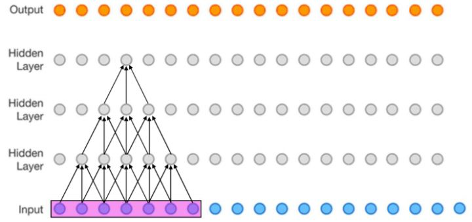

# XAI_exp
* 基于可视化:  
LIME/Anchor  
LRP   
GRAD-CAM  
IG  
Shapley-value   
(Attention)  
* 基于可解释模型：  
Neural-ODE   
Optimal-Transportation  
 

# 编程练习21: 空洞卷积

作者：author1@mail.com, author2@mail.com, author3@mail.com  (尽量提供 Github 账号对应的邮箱)

## 知识点介绍

1、定义：
空洞卷积是一种不增加参数数量，同时增加输出单元感受野的一种方法，也称为膨胀卷积。
2、感受野：
感受野是一个神经元对原始图像的感受区域的大小。空洞卷积是通过对卷积核相邻元素之间插入D-1个空洞来变相地增加其大小，其中D为膨胀率。将三层的卷积神经网络简化为一维结构，每一层卷积核的大小为3，步长为1，那么最上层特征所对应的感受野就为如图所示：

3、感受野的计算方式：

* 卷积核与感受野的计算如下：

* 当前层的感受野计算公式如下：

其中 ，〖RF〗_i表示上一层的感受野，k^’表示卷积核的大小，S^’表示之前所有层的步长的乘积，但不包括本层，公式如下：

## 任务描述

利用torch与TensorFlow上练习空洞卷积。

## 数据集

样例使用的数据集为Fashion-MNIST。它是一个类似MNIST的图片数据集，为服装的分类。Fashion-MNIST与MNIST一样分为10类，每张图片的大小为28*28像素，其中包含训练集50000张，测试集10000张样本图片。

根据http://fashion-mnist.s3-website.eu-central-1.amazonaws.com/# 的benchmark，在Fashion-MNIST用传统方法(不使用深度学习)的准确率不到90%。

## 题目要求

请用tensorflow在Fashion-Mnist上实现空洞卷积神经网络，并打印训练集与测试集的accuracy。

要求：

`·用jupyter notebook编写。`

`·优化器使用Adam，学习率为0.003，batch size为128。`

## 参考文献

[1] L.-C. Chen, G. Papandreou, I. Kokkinos, K. Murphy, and A. L. Yuille. Deeplab: Semantic image segmentation with deep convolutional nets, atrous convolution, and fully connected crfs. IEEE transactions on pattern analysis and machine intelligence, 40(4):834–848, 2017
